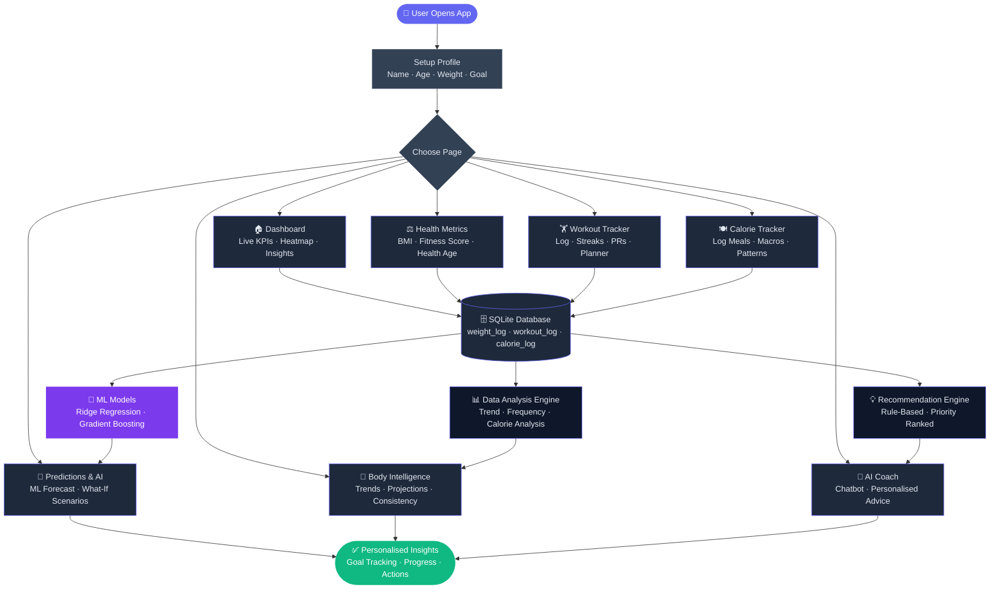

# 🏋️ AI Fitness Coach

<div align="center">


### 🚀 [**Live Demo → Click Here**](https://ai-fitness-coach-hecmm6xp8tjvtqt83ihwtg.streamlit.app/)

A fully-featured AI-powered fitness tracking web app built with Python & Streamlit.
Track workouts, calories, body metrics, and get personalised ML-based predictions — all in one place.

</div>

---

## 🗺️ App Flowchart



---

## ✨ Features

### 🏠 Dashboard
- Live KPI strip — weight, BMI, calories, workouts
- Monthly workout heatmap
- Today's progress ring with macro bars
- Smart insights cards & goals schedule

### 👤 My Profile
- Profile avatar card with fitness level badge
- Target weight & date of birth tracking
- Weight trend mini sparkline chart
- Delete weight entries

### ⚖️ Health Metrics
- **Fitness Score** (0–100) across 4 components
- **Health Age** — biological age estimate
- **BMI** with visual category indicator
- **WHtR** — waist-to-height ratio risk assessment
- Body fat percentage & water intake targets

### 🏋️ Workout Tracker
- Log workouts with sets, reps & intensity
- MET-based calorie burn calculation
- Personal Records by exercise
- Category streaks (Cardio / Strength / Flexibility / Sports)
- Weekly workout planner (Mon–Sun)
- Edit & delete workout entries

### 🍽️ Calorie Tracker
- Quick-add 10 common foods in one click
- Meal timing breakdown (Breakfast / Lunch / Dinner / Snacks)
- Calorie-to-goal calculator with ETA
- Meal pattern insights (7-day analysis)
- Delete meal entries

### 🧬 Body Intelligence
- **Weight Analysis** — trend velocity & 30/60/90-day projection
- **Workout Analysis** — weekly volume progression & top 5 exercises
- **Calorie Analysis** — best & worst calorie days
- **Consistency Score** — 4-week heatmap grid with A/B/C/D grades

### 🔮 Predictions & AI
- **Weight Predictor** — ML-powered 30-day weight forecast with sliders
- **What-If Scenarios** — instantly compare 5 different plans
- **Calorie Burn Predictor** — exercise calorie estimator with real-world equivalents
- **Exercise Comparison** — rank exercises by calories burned

### 💬 AI Coach (Chatbot)
- Rule-based fitness chatbot — no API key needed
- 15+ topics: BMI, calories, macros, TDEE, workouts, protein, supplements, sleep, motivation
- Quick-reply buttons for instant answers
- Personalised responses using your actual profile data
- WhatsApp-style chat bubble UI

---

## 🧠 Machine Learning Models

| Model | Algorithm | Features | Accuracy |
|---|---|---|---|
| Weight Predictor | Ridge Regression | Day index, calories eaten, calories burned, workouts | MAE ~0.29 kg |
| Calorie Burn Predictor | Gradient Boosting | Duration, body weight, MET value | MAE ~32 kcal |

Models are pre-trained on synthetic data and can be **retrained with your own logged data** directly inside the app.

---

## 🗂️ Project Structure

```
ai-fitness-coach/
├── app.py                  # Main Streamlit app (8 pages)
├── database.py             # SQLite database layer
├── ml_model.py             # ML models (WeightPredictor, CalorieBurnPredictor)
├── ai_recommendation.py    # Rule-based recommendation engine
├── workout_tracker.py      # Workout logic & calorie calculations
├── calorie_calculator.py   # TDEE, BMR, macro calculations
├── data_analysis.py        # Trend analysis & statistics
├── charts.py               # Plotly chart builders
├── bmi.py                  # BMI & body composition calculations
├── models/
│   ├── weight_predictor.joblib
│   └── calorie_burn_predictor.joblib
├── .streamlit/
│   └── config.toml
├── requirements.txt
└── README.md
```

---

## 🛠️ Tech Stack

| Category | Technology |
|---|---|
| Frontend | Streamlit |
| Language | Python 3.11 |
| Database | SQLite |
| ML Models | Scikit-learn (Ridge, GradientBoosting) |
| Charts | Plotly |
| Data | Pandas, NumPy |
| Model Storage | Joblib |

---

## 🚀 Run Locally

### 1. Clone the repository
```bash
git clone https://github.com/OmPatil2806/AI-Fitness-Coach.git
cd AI-Fitness-Coach
```

### 2. Create virtual environment
```bash
python -m venv venv
venv\Scripts\activate        # Windows
source venv/bin/activate     # Mac/Linux
```

### 3. Install dependencies
```bash
pip install -r requirements.txt
```

### 4. Generate ML models
```bash
python save_models.py
```

### 5. Run the app
```bash
streamlit run app.py
```

Open **http://localhost:8501** in your browser 🎉

---

## 🌐 Deploy on Streamlit Cloud

1. Fork this repository
2. Go to [share.streamlit.io](https://share.streamlit.io)
3. Connect your GitHub account
4. Select this repo → `main` branch → `app.py`
5. Click **Deploy** 🚀

---

## 📊 Database Schema

| Table | Description |
|---|---|
| `user_profile` | Name, age, gender, weight, height, goal, fitness level |
| `weight_log` | Daily weight entries with timestamps |
| `workout_log` | Exercise name, duration, calories, sets, reps, intensity |
| `calorie_log` | Food name, calories, macros, meal type, timestamp |

---

## 🗺️ Roadmap

- [ ] 🤖 Claude AI chatbot integration
- [ ] 📄 Monthly PDF progress report export
- [ ] 🔍 Food search database (Open Food Facts API)
- [ ] 🏆 Achievement badges & XP system
- [ ] 📏 Body measurements tracker
- [ ] 😴 Sleep & mood tracker
- [ ] 📸 Food photo calorie detection
- [ ] 👥 Multi-user login system
- [ ] 🐘 PostgreSQL for persistent cloud storage
- [ ] 📱 Google Fit / Apple Health API sync

---

## 📄 License

This project is open source and available under the [MIT License](LICENSE).

---

<div align="center">

**⭐ If you found this useful, please star the repository! ⭐**

[🚀 Live Demo](https://ai-fitness-coach-hecmm6xp8tjvtqt83ihwtg.streamlit.app/) · [🐛 Report Bug](https://github.com/OmPatil2806/AI-Fitness-Coach/issues) · [✨ Request Feature](https://github.com/OmPatil2806/AI-Fitness-Coach/issues)

</div>
